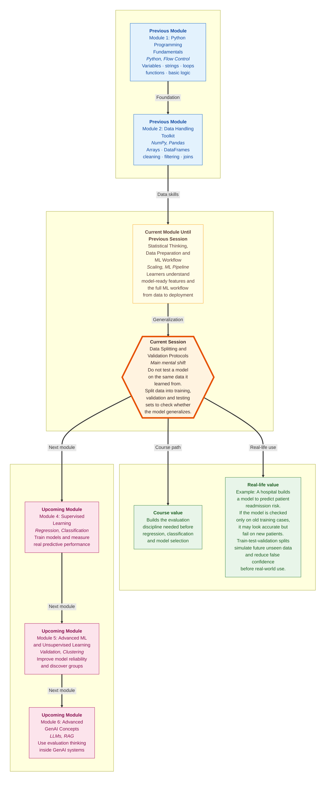

```mermaid
%%{init: {'flowchart': {'nodeSpacing': 80, 'rankSpacing': 90, 'diagramPadding': 35}}}%%
flowchart TB
  subgraph foundation[" "]
    direction TB
    M1["<b>Previous Module</b><br/>Module 1: Python Programming<br/>Fundamentals<br/><i>Python, Flow Control</i><br/>Variables · strings · loops<br/>functions · basic logic"]

    M2["<b>Previous Module</b><br/>Module 2: Data Handling<br/>Toolkit<br/><i>NumPy, Pandas</i><br/>Arrays · DataFrames<br/>cleaning · filtering · joins"]
  end

  subgraph path[" "]
    direction TB
    M3U["<b>Current Module Until<br/>Previous Session</b><br/>Statistical Thinking,<br/>Data Preparation and<br/>ML Workflow<br/><i>Scaling, ML Pipeline</i><br/>Learners understand<br/>model-ready features and<br/>the full ML workflow<br/>from data to deployment"]

    CUR{{"<b>Current Session</b><br/>Data Splitting and<br/>Validation Protocols<br/><i>Main mental shift</i><br/>Do not test a model<br/>on the same data it<br/>learned from.<br/>Split data into training,<br/>validation and testing<br/>sets to check whether<br/>the model generalizes."}}
  end

  subgraph value[" "]
    direction LR
    CV["<b>Course value</b><br/>Builds the evaluation<br/>discipline needed before<br/>regression, classification<br/>and model selection"]

    RL["<b>Real-life value</b><br/>Example: A hospital builds<br/>a model to predict patient<br/>readmission risk.<br/>If the model is checked<br/>only on old training cases,<br/>it may look accurate but<br/>fail on new patients.<br/>Train-test-validation splits<br/>simulate future unseen data<br/>and reduce false confidence<br/>before real-world use."]
  end

  subgraph future[" "]
    direction TB
    M4["<b>Upcoming Module</b><br/>Module 4: Supervised<br/>Learning<br/><i>Regression, Classification</i><br/>Train models and measure<br/>real predictive performance"]

    M5["<b>Upcoming Module</b><br/>Module 5: Advanced ML<br/>and Unsupervised Learning<br/><i>Validation, Clustering</i><br/>Improve model reliability<br/>and discover groups"]

    M6["<b>Upcoming Module</b><br/>Module 6: Advanced<br/>GenAI Concepts<br/><i>LLMs, RAG</i><br/>Use evaluation thinking<br/>inside GenAI systems"]
  end

  M1 ==>|&nbsp;Foundation&nbsp;| M2
  M2 ==>|&nbsp;Data skills&nbsp;| M3U
  M3U ==>|&nbsp;Generalization&nbsp;| CUR
  CUR ==>|&nbsp;Course path&nbsp;| CV
  CUR ==>|&nbsp;Real-life use&nbsp;| RL
  CUR ==>|&nbsp;Next module&nbsp;| M4
  M4 ==>|&nbsp;Next module&nbsp;| M5
  M5 ==>|&nbsp;Next module&nbsp;| M6

  classDef prev fill:#e3f2fd,stroke:#1565c0,color:#0d47a1
  classDef currMod fill:#fffde7,stroke:#f9a825,color:#5d4037
  classDef currSes fill:#fff3e0,stroke:#e65100,color:#3e2723,stroke-width:5px
  classDef val fill:#e8f5e9,stroke:#2e7d32,color:#1b5e20
  classDef fut fill:#fce4ec,stroke:#ad1457,color:#880e4f

  class M1,M2 prev
  class M3U currMod
  class CUR currSes
  class CV,RL val
  class M4,M5,M6 fut

  linkStyle default stroke-width:3px
```
