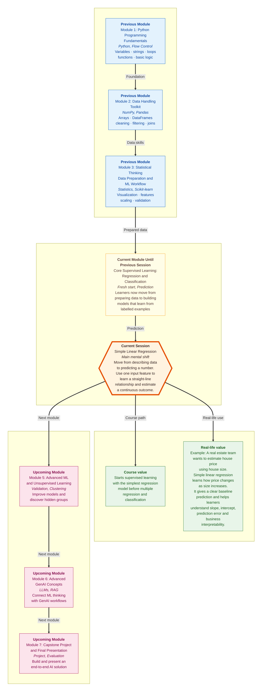

```mermaid
%%{init: {'flowchart': {'nodeSpacing': 80, 'rankSpacing': 90, 'diagramPadding': 35}}}%%
flowchart TB
  subgraph foundation[" "]
    direction TB
    M1["<b>Previous Module</b><br/>Module 1: Python Programming<br/>Fundamentals<br/><i>Python, Flow Control</i><br/>Variables · strings · loops<br/>functions · basic logic"]

    M2["<b>Previous Module</b><br/>Module 2: Data Handling<br/>Toolkit<br/><i>NumPy, Pandas</i><br/>Arrays · DataFrames<br/>cleaning · filtering · joins"]

    M3["<b>Previous Module</b><br/>Module 3: Statistical Thinking<br/>Data Preparation and<br/>ML Workflow<br/><i>Statistics, Scikit-learn</i><br/>Visualization · features<br/>scaling · validation"]
  end

  subgraph path[" "]
    direction TB
    M4U["<b>Current Module Until<br/>Previous Session</b><br/>Core Supervised Learning:<br/>Regression and Classification<br/><i>Fresh start, Prediction</i><br/>Learners now move from<br/>preparing data to building<br/>models that learn from<br/>labelled examples"]

    CUR{{"<b>Current Session</b><br/>Simple Linear Regression<br/><i>Main mental shift</i><br/>Move from describing data<br/>to predicting a number.<br/>Use one input feature to<br/>learn a straight-line<br/>relationship and estimate<br/>a continuous outcome."}}
  end

  subgraph value[" "]
    direction LR
    CV["<b>Course value</b><br/>Starts supervised learning<br/>with the simplest regression<br/>model before multiple<br/>regression and classification"]

    RL["<b>Real-life value</b><br/>Example: A real estate team<br/>wants to estimate house price<br/>using house size.<br/>Simple linear regression<br/>learns how price changes<br/>as size increases.<br/>It gives a clear baseline<br/>prediction and helps learners<br/>understand slope, intercept,<br/>prediction error and business<br/>interpretability."]
  end

  subgraph future[" "]
    direction TB
    M5["<b>Upcoming Module</b><br/>Module 5: Advanced ML<br/>and Unsupervised Learning<br/><i>Validation, Clustering</i><br/>Improve models and<br/>discover hidden groups"]

    M6["<b>Upcoming Module</b><br/>Module 6: Advanced<br/>GenAI Concepts<br/><i>LLMs, RAG</i><br/>Connect ML thinking<br/>with GenAI workflows"]

    M7["<b>Upcoming Module</b><br/>Module 7: Capstone Project<br/>and Final Presentation<br/><i>Project, Evaluation</i><br/>Build and present an<br/>end-to-end AI solution"]
  end

  M1 ==>|&nbsp;Foundation&nbsp;| M2
  M2 ==>|&nbsp;Data skills&nbsp;| M3
  M3 ==>|&nbsp;Prepared data&nbsp;| M4U
  M4U ==>|&nbsp;Prediction&nbsp;| CUR
  CUR ==>|&nbsp;Course path&nbsp;| CV
  CUR ==>|&nbsp;Real-life use&nbsp;| RL
  CUR ==>|&nbsp;Next module&nbsp;| M5
  M5 ==>|&nbsp;Next module&nbsp;| M6
  M6 ==>|&nbsp;Next module&nbsp;| M7

  classDef prev fill:#e3f2fd,stroke:#1565c0,color:#0d47a1
  classDef currMod fill:#fffde7,stroke:#f9a825,color:#5d4037
  classDef currSes fill:#fff3e0,stroke:#e65100,color:#3e2723,stroke-width:5px
  classDef val fill:#e8f5e9,stroke:#2e7d32,color:#1b5e20
  classDef fut fill:#fce4ec,stroke:#ad1457,color:#880e4f

  class M1,M2,M3 prev
  class M4U currMod
  class CUR currSes
  class CV,RL val
  class M5,M6,M7 fut

  linkStyle default stroke-width:3px
```
