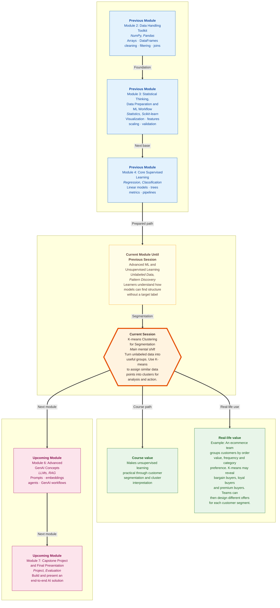

```mermaid
%%{init: {'flowchart': {'nodeSpacing': 80, 'rankSpacing': 90, 'padding': 35}, 'diagramPadding': 35}}%%
flowchart TB
  subgraph foundation[" "]
    direction TB
    M2["<b>Previous Module</b><br/>Module 2: Data Handling<br/>Toolkit<br/><i>NumPy, Pandas</i><br/>Arrays · DataFrames<br/>cleaning · filtering · joins"]

    M3["<b>Previous Module</b><br/>Module 3: Statistical Thinking,<br/>Data Preparation and<br/>ML Workflow<br/><i>Statistics, Scikit-learn</i><br/>Visualization · features<br/>scaling · validation"]

    M4["<b>Previous Module</b><br/>Module 4: Core Supervised<br/>Learning<br/><i>Regression, Classification</i><br/>Linear models · trees<br/>metrics · pipelines"]
  end

  subgraph path[" "]
    direction TB
    CMU["<b>Current Module Until<br/>Previous Session</b><br/>Advanced ML and<br/>Unsupervised Learning<br/><i>Unlabeled Data,<br/>Pattern Discovery</i><br/>Learners understand how<br/>models can find structure<br/>without a target label"]

    CUR{{"<b>Current Session</b><br/>K-means Clustering<br/>for Segmentation<br/><i>Main mental shift</i><br/>Turn unlabeled data into<br/>useful groups. Use K-means<br/>to assign similar data<br/>points into clusters for<br/>analysis and action."}}
  end

  subgraph value[" "]
    direction LR
    CV["<b>Course value</b><br/>Makes unsupervised learning<br/>practical through customer<br/>segmentation and cluster<br/>interpretation"]

    RL["<b>Real-life value</b><br/>Example: An ecommerce team<br/>groups customers by order<br/>value, frequency and category<br/>preference. K-means may reveal<br/>bargain buyers, loyal buyers<br/>and premium buyers. Teams can<br/>then design different offers<br/>for each customer segment."]
  end

  subgraph future[" "]
    direction TB
    M6["<b>Upcoming Module</b><br/>Module 6: Advanced<br/>GenAI Concepts<br/><i>LLMs, RAG</i><br/>Prompts · embeddings<br/>agents · GenAI workflows"]

    M7["<b>Upcoming Module</b><br/>Module 7: Capstone Project<br/>and Final Presentation<br/><i>Project, Evaluation</i><br/>Build and present an<br/>end-to-end AI solution"]
  end

  M2 ==>|&nbsp;Foundation&nbsp;| M3
  M3 ==>|&nbsp;Next base&nbsp;| M4
  M4 ==>|&nbsp;Prepared path&nbsp;| CMU
  CMU ==>|&nbsp;Segmentation&nbsp;| CUR
  CUR ==>|&nbsp;Course path&nbsp;| CV
  CUR ==>|&nbsp;Real-life use&nbsp;| RL
  CUR ==>|&nbsp;Next module&nbsp;| M6
  M6 ==>|&nbsp;Next module&nbsp;| M7

  classDef prev fill:#e3f2fd,stroke:#1565c0,color:#0d47a1
  classDef currMod fill:#fffde7,stroke:#f9a825,color:#5d4037
  classDef currSes fill:#fff3e0,stroke:#e65100,color:#3e2723,stroke-width:5px
  classDef val fill:#e8f5e9,stroke:#2e7d32,color:#1b5e20
  classDef fut fill:#fce4ec,stroke:#ad1457,color:#880e4f

  class M2,M3,M4 prev
  class CMU currMod
  class CUR currSes
  class CV,RL val
  class M6,M7 fut

  linkStyle default stroke-width:3px
```
