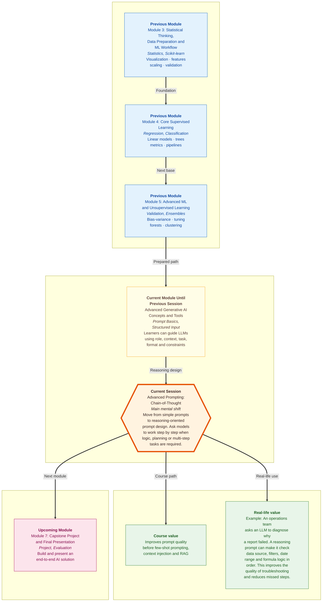

```mermaid
%%{init: {'flowchart': {'nodeSpacing': 80, 'rankSpacing': 90, 'padding': 35}, 'diagramPadding': 35}}%%
flowchart TB
  subgraph foundation[" "]
    direction TB
    M3["<b>Previous Module</b><br/>Module 3: Statistical Thinking,<br/>Data Preparation and<br/>ML Workflow<br/><i>Statistics, Scikit-learn</i><br/>Visualization · features<br/>scaling · validation"]

    M4["<b>Previous Module</b><br/>Module 4: Core Supervised<br/>Learning<br/><i>Regression, Classification</i><br/>Linear models · trees<br/>metrics · pipelines"]

    M5["<b>Previous Module</b><br/>Module 5: Advanced ML<br/>and Unsupervised Learning<br/><i>Validation, Ensembles</i><br/>Bias-variance · tuning<br/>forests · clustering"]
  end

  subgraph path[" "]
    direction TB
    CMU["<b>Current Module Until<br/>Previous Session</b><br/>Advanced Generative AI<br/>Concepts and Tools<br/><i>Prompt Basics,<br/>Structured Input</i><br/>Learners can guide LLMs<br/>using role, context, task,<br/>format and constraints"]

    CUR{{"<b>Current Session</b><br/>Advanced Prompting:<br/>Chain-of-Thought<br/><i>Main mental shift</i><br/>Move from simple prompts<br/>to reasoning-oriented<br/>prompt design. Ask models<br/>to work step by step when<br/>logic, planning or multi-step<br/>tasks are required."}}
  end

  subgraph value[" "]
    direction LR
    CV["<b>Course value</b><br/>Improves prompt quality<br/>before few-shot prompting,<br/>context injection and RAG"]

    RL["<b>Real-life value</b><br/>Example: An operations team<br/>asks an LLM to diagnose why<br/>a report failed. A reasoning<br/>prompt can make it check<br/>data source, filters, date<br/>range and formula logic in<br/>order. This improves the<br/>quality of troubleshooting<br/>and reduces missed steps."]
  end

  subgraph future[" "]
    direction TB
    M7["<b>Upcoming Module</b><br/>Module 7: Capstone Project<br/>and Final Presentation<br/><i>Project, Evaluation</i><br/>Build and present an<br/>end-to-end AI solution"]
  end

  M3 ==>|&nbsp;Foundation&nbsp;| M4
  M4 ==>|&nbsp;Next base&nbsp;| M5
  M5 ==>|&nbsp;Prepared path&nbsp;| CMU
  CMU ==>|&nbsp;Reasoning design&nbsp;| CUR
  CUR ==>|&nbsp;Course path&nbsp;| CV
  CUR ==>|&nbsp;Real-life use&nbsp;| RL
  CUR ==>|&nbsp;Next module&nbsp;| M7

  classDef prev fill:#e3f2fd,stroke:#1565c0,color:#0d47a1
  classDef currMod fill:#fffde7,stroke:#f9a825,color:#5d4037
  classDef currSes fill:#fff3e0,stroke:#e65100,color:#3e2723,stroke-width:5px
  classDef val fill:#e8f5e9,stroke:#2e7d32,color:#1b5e20
  classDef fut fill:#fce4ec,stroke:#ad1457,color:#880e4f

  class M3,M4,M5 prev
  class CMU currMod
  class CUR currSes
  class CV,RL val
  class M7 fut

  linkStyle default stroke-width:3px
```
