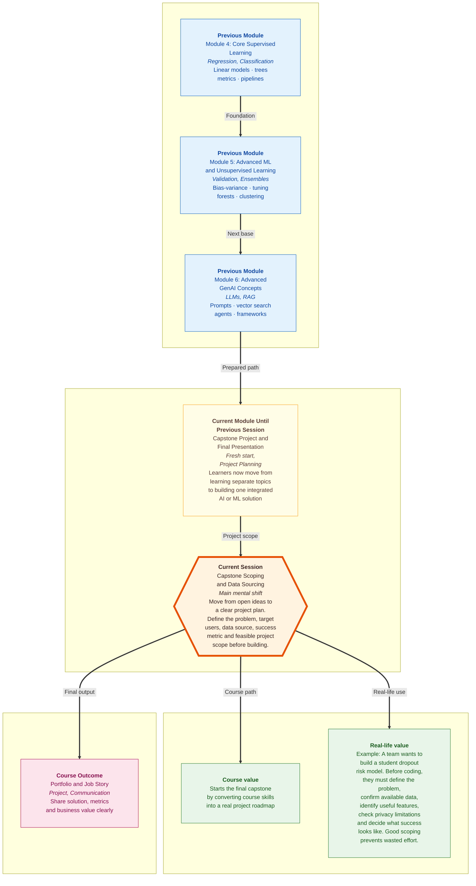

```mermaid
%%{init: {'flowchart': {'nodeSpacing': 80, 'rankSpacing': 90, 'padding': 35}, 'diagramPadding': 35}}%%
flowchart TB
  subgraph foundation[" "]
    direction TB
    M4["<b>Previous Module</b><br/>Module 4: Core Supervised<br/>Learning<br/><i>Regression, Classification</i><br/>Linear models · trees<br/>metrics · pipelines"]

    M5["<b>Previous Module</b><br/>Module 5: Advanced ML<br/>and Unsupervised Learning<br/><i>Validation, Ensembles</i><br/>Bias-variance · tuning<br/>forests · clustering"]

    M6["<b>Previous Module</b><br/>Module 6: Advanced<br/>GenAI Concepts<br/><i>LLMs, RAG</i><br/>Prompts · vector search<br/>agents · frameworks"]
  end

  subgraph path[" "]
    direction TB
    CMU["<b>Current Module Until<br/>Previous Session</b><br/>Capstone Project and<br/>Final Presentation<br/><i>Fresh start,<br/>Project Planning</i><br/>Learners now move from<br/>learning separate topics<br/>to building one integrated<br/>AI or ML solution"]

    CUR{{"<b>Current Session</b><br/>Capstone Scoping<br/>and Data Sourcing<br/><i>Main mental shift</i><br/>Move from open ideas to<br/>a clear project plan.<br/>Define the problem, target<br/>users, data source, success<br/>metric and feasible project<br/>scope before building."}}
  end

  subgraph value[" "]
    direction LR
    CV["<b>Course value</b><br/>Starts the final capstone<br/>by converting course skills<br/>into a real project roadmap"]

    RL["<b>Real-life value</b><br/>Example: A team wants to<br/>build a student dropout<br/>risk model. Before coding,<br/>they must define the problem,<br/>confirm available data,<br/>identify useful features,<br/>check privacy limitations<br/>and decide what success<br/>looks like. Good scoping<br/>prevents wasted effort."]
  end

  subgraph future[" "]
    direction TB
    OUT["<b>Course Outcome</b><br/>Portfolio and Job Story<br/><i>Project, Communication</i><br/>Share solution, metrics<br/>and business value clearly"]
  end

  M4 ==>|&nbsp;Foundation&nbsp;| M5
  M5 ==>|&nbsp;Next base&nbsp;| M6
  M6 ==>|&nbsp;Prepared path&nbsp;| CMU
  CMU ==>|&nbsp;Project scope&nbsp;| CUR
  CUR ==>|&nbsp;Course path&nbsp;| CV
  CUR ==>|&nbsp;Real-life use&nbsp;| RL
  CUR ==>|&nbsp;Final output&nbsp;| OUT

  classDef prev fill:#e3f2fd,stroke:#1565c0,color:#0d47a1
  classDef currMod fill:#fffde7,stroke:#f9a825,color:#5d4037
  classDef currSes fill:#fff3e0,stroke:#e65100,color:#3e2723,stroke-width:5px
  classDef val fill:#e8f5e9,stroke:#2e7d32,color:#1b5e20
  classDef fut fill:#fce4ec,stroke:#ad1457,color:#880e4f

  class M4,M5,M6 prev
  class CMU currMod
  class CUR currSes
  class CV,RL val
  class OUT fut

  linkStyle default stroke-width:3px
```
