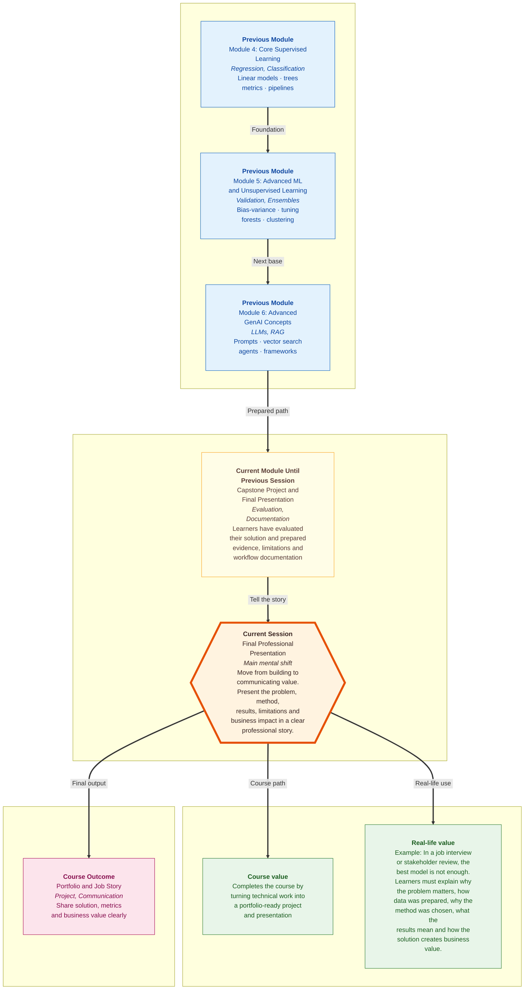

```mermaid
%%{init: {'flowchart': {'nodeSpacing': 80, 'rankSpacing': 90, 'padding': 35}, 'diagramPadding': 35}}%%
flowchart TB
  subgraph foundation[" "]
    direction TB
    M4["<b>Previous Module</b><br/>Module 4: Core Supervised<br/>Learning<br/><i>Regression, Classification</i><br/>Linear models · trees<br/>metrics · pipelines"]

    M5["<b>Previous Module</b><br/>Module 5: Advanced ML<br/>and Unsupervised Learning<br/><i>Validation, Ensembles</i><br/>Bias-variance · tuning<br/>forests · clustering"]

    M6["<b>Previous Module</b><br/>Module 6: Advanced<br/>GenAI Concepts<br/><i>LLMs, RAG</i><br/>Prompts · vector search<br/>agents · frameworks"]
  end

  subgraph path[" "]
    direction TB
    CMU["<b>Current Module Until<br/>Previous Session</b><br/>Capstone Project and<br/>Final Presentation<br/><i>Evaluation,<br/>Documentation</i><br/>Learners have evaluated<br/>their solution and prepared<br/>evidence, limitations and<br/>workflow documentation"]

    CUR{{"<b>Current Session</b><br/>Final Professional<br/>Presentation<br/><i>Main mental shift</i><br/>Move from building to<br/>communicating value.<br/>Present the problem, method,<br/>results, limitations and<br/>business impact in a clear<br/>professional story."}}
  end

  subgraph value[" "]
    direction LR
    CV["<b>Course value</b><br/>Completes the course by<br/>turning technical work into<br/>a portfolio-ready project<br/>and presentation"]

    RL["<b>Real-life value</b><br/>Example: In a job interview<br/>or stakeholder review, the<br/>best model is not enough.<br/>Learners must explain why<br/>the problem matters, how<br/>data was prepared, why the<br/>method was chosen, what the<br/>results mean and how the<br/>solution creates business<br/>value."]
  end

  subgraph future[" "]
    direction TB
    OUT["<b>Course Outcome</b><br/>Portfolio and Job Story<br/><i>Project, Communication</i><br/>Share solution, metrics<br/>and business value clearly"]
  end

  M4 ==>|&nbsp;Foundation&nbsp;| M5
  M5 ==>|&nbsp;Next base&nbsp;| M6
  M6 ==>|&nbsp;Prepared path&nbsp;| CMU
  CMU ==>|&nbsp;Tell the story&nbsp;| CUR
  CUR ==>|&nbsp;Course path&nbsp;| CV
  CUR ==>|&nbsp;Real-life use&nbsp;| RL
  CUR ==>|&nbsp;Final output&nbsp;| OUT

  classDef prev fill:#e3f2fd,stroke:#1565c0,color:#0d47a1
  classDef currMod fill:#fffde7,stroke:#f9a825,color:#5d4037
  classDef currSes fill:#fff3e0,stroke:#e65100,color:#3e2723,stroke-width:5px
  classDef val fill:#e8f5e9,stroke:#2e7d32,color:#1b5e20
  classDef fut fill:#fce4ec,stroke:#ad1457,color:#880e4f

  class M4,M5,M6 prev
  class CMU currMod
  class CUR currSes
  class CV,RL val
  class OUT fut

  linkStyle default stroke-width:3px
```
